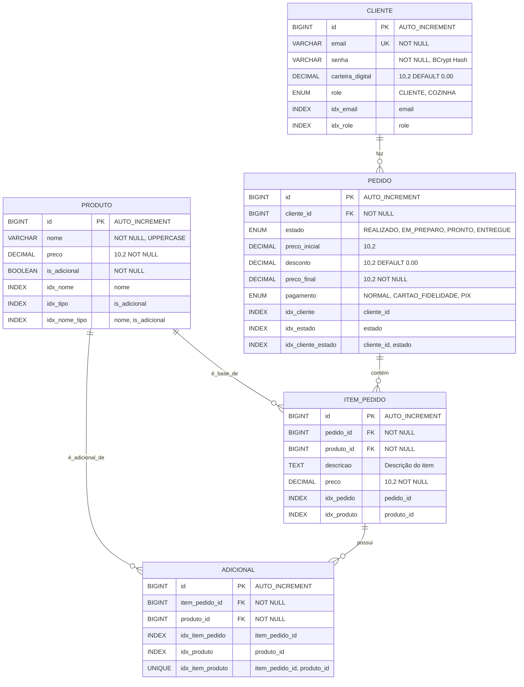

# Análise Completa do Banco de Dados - Sistema Varanda Cafeteria

## Visão Geral

O banco de dados do sistema Varanda Cafeteria foi projetado para suportar um sistema de pedidos de cafeteria com funcionalidades de autenticação, gestão de produtos, processamento de pedidos e notificações em tempo real. A estrutura segue princípios de normalização e integridade referencial.

## Estrutura das Entidades

### 1. CLIENTE
**Propósito**: Armazena informações dos usuários do sistema (clientes e funcionários da cozinha)

**Campos**:
- `id` (BIGINT, PK, AUTO_INCREMENT): Identificador único do cliente
- `email` (VARCHAR, UNIQUE, NOT NULL): Email único para login
- `senha` (VARCHAR, NOT NULL): Senha criptografada com BCrypt
- `carteira_digital` (DECIMAL(10,2)): Saldo disponível na carteira digital
- `role` (ENUM): Papel do usuário no sistema ('CLIENTE', 'COZINHA')

**Características**:
- Suporte a autenticação JWT
- Carteira digital integrada para pagamentos
- Sistema de roles para controle de acesso

### 2. PRODUTO
**Propósito**: Catálogo de produtos disponíveis (bebidas base e adicionais)

**Campos**:
- `id` (BIGINT, PK, AUTO_INCREMENT): Identificador único do produto
- `nome` (VARCHAR, NOT NULL): Nome do produto (armazenado em maiúsculas)
- `preco` (DECIMAL(10,2), NOT NULL): Preço unitário do produto
- `is_adicional` (BOOLEAN, NOT NULL): Flag indicando se é adicional (true) ou bebida base (false)

**Características**:
- Flexibilidade para diferentes tipos de produtos
- Preços com precisão decimal
- Categorização automática entre bebidas base e adicionais

### 3. PEDIDO
**Propósito**: Registro central dos pedidos realizados pelos clientes

**Campos**:
- `id` (BIGINT, PK, AUTO_INCREMENT): Identificador único do pedido
- `cliente_id` (BIGINT, FK): Referência ao cliente que fez o pedido
- `estado` (ENUM): Estado atual do pedido ('REALIZADO', 'EM_PREPARO', 'PRONTO', 'ENTREGUE')
- `preco_inicial` (DECIMAL(10,2)): Valor antes dos descontos
- `desconto` (DECIMAL(10,2)): Valor do desconto aplicado
- `preco_final` (DECIMAL(10,2)): Valor final após descontos
- `pagamento` (ENUM): Tipo de pagamento ('NORMAL', 'CARTAO_FIDELIDADE', 'PIX')

**Características**:
- Rastreamento completo do ciclo de vida do pedido
- Sistema de descontos baseado no tipo de pagamento
- Auditoria financeira completa

### 4. ITEM_PEDIDO
**Propósito**: Detalhamento dos itens individuais dentro de cada pedido

**Campos**:
- `id` (BIGINT, PK, AUTO_INCREMENT): Identificador único do item
- `pedido_id` (BIGINT, FK): Referência ao pedido pai
- `produto_id` (BIGINT, FK): Referência ao produto base (bebida)
- `descricao` (TEXT): Descrição textual do item com adicionais
- `preco` (DECIMAL(10,2)): Preço final do item (base + adicionais)

**Características**:
- Composição flexível de produtos
- Preço calculado dinamicamente
- Descrição legível para o usuário

### 5. ADICIONAL
**Propósito**: Registro dos adicionais aplicados a cada item do pedido

**Campos**:
- `id` (BIGINT, PK, AUTO_INCREMENT): Identificador único do adicional
- `item_pedido_id` (BIGINT, FK): Referência ao item do pedido
- `produto_id` (BIGINT, FK): Referência ao produto adicional

**Características**:
- Relacionamento many-to-many entre itens e produtos adicionais
- Flexibilidade para múltiplos adicionais por item
- Rastreabilidade completa dos componentes

## Diagrama Lógico do Banco de Dados



## Análise dos Relacionamentos

### 1. CLIENTE → PEDIDO (1:N)
- **Cardinalidade**: Um cliente pode fazer múltiplos pedidos
- **Integridade**: FK com CASCADE para manter histórico
- **Índices**: Otimizado para busca por cliente e estado

### 2. PEDIDO → ITEM_PEDIDO (1:N)
- **Cardinalidade**: Um pedido pode ter múltiplos itens
- **Integridade**: FK com CASCADE DELETE para consistência
- **Agregação**: Preço do pedido calculado a partir dos itens

### 3. PRODUTO → ITEM_PEDIDO (1:N)
- **Cardinalidade**: Um produto pode ser base de múltiplos itens
- **Restrição**: Apenas produtos com `is_adicional = false`
- **Integridade**: FK com RESTRICT para preservar histórico

### 4. ITEM_PEDIDO → ADICIONAL (1:N)
- **Cardinalidade**: Um item pode ter múltiplos adicionais
- **Composição**: Adicionais são parte integral do item
- **Integridade**: FK com CASCADE DELETE

### 5. PRODUTO → ADICIONAL (1:N)
- **Cardinalidade**: Um produto adicional pode ser usado em múltiplos itens
- **Restrição**: Apenas produtos com `is_adicional = true`
- **Constraint**: Unique constraint para evitar duplicatas

## Padrões de Design Implementados

### 1. **Composite Pattern**
- PEDIDO como composite contendo ITEM_PEDIDO
- ITEM_PEDIDO como composite contendo ADICIONAL
- Permite estrutura hierárquica flexível

### 2. **Strategy Pattern (Implícito)**
- Campo `pagamento` permite diferentes estratégias de desconto
- Campo `role` permite diferentes comportamentos por tipo de usuário

### 3. **State Pattern (Implícito)**
- Campo `estado` do pedido representa estados bem definidos
- Transições controladas pela aplicação

## Otimizações e Índices

### Índices Primários
- Todos os IDs são chaves primárias com AUTO_INCREMENT
- Otimizados para inserção sequencial

### Índices Secundários
```sql
-- Busca de clientes por email (login)
CREATE INDEX idx_cliente_email ON CLIENTE(email);

-- Busca de produtos por nome e tipo
CREATE INDEX idx_produto_nome_tipo ON PRODUTO(nome, is_adicional);

-- Busca de pedidos por cliente e estado
CREATE INDEX idx_pedido_cliente_estado ON PEDIDO(cliente_id, estado);

-- Busca de itens por pedido
CREATE INDEX idx_item_pedido ON ITEM_PEDIDO(pedido_id);

-- Prevenção de adicionais duplicados
CREATE UNIQUE INDEX idx_adicional_unique ON ADICIONAL(item_pedido_id, produto_id);
```

### Índices Compostos
- Otimizados para queries frequentes da aplicação
- Reduzem necessidade de table scans
- Melhoram performance de JOINs

## Integridade Referencial

### Constraints de Chave Estrangeira
```sql
-- Pedido pertence a um cliente
ALTER TABLE PEDIDO ADD CONSTRAINT fk_pedido_cliente 
    FOREIGN KEY (cliente_id) REFERENCES CLIENTE(id) ON DELETE RESTRICT;

-- Item pertence a um pedido
ALTER TABLE ITEM_PEDIDO ADD CONSTRAINT fk_item_pedido 
    FOREIGN KEY (pedido_id) REFERENCES PEDIDO(id) ON DELETE CASCADE;

-- Item tem um produto base
ALTER TABLE ITEM_PEDIDO ADD CONSTRAINT fk_item_produto 
    FOREIGN KEY (produto_id) REFERENCES PRODUTO(id) ON DELETE RESTRICT;

-- Adicional pertence a um item
ALTER TABLE ADICIONAL ADD CONSTRAINT fk_adicional_item 
    FOREIGN KEY (item_pedido_id) REFERENCES ITEM_PEDIDO(id) ON DELETE CASCADE;

-- Adicional referencia um produto
ALTER TABLE ADICIONAL ADD CONSTRAINT fk_adicional_produto 
    FOREIGN KEY (produto_id) REFERENCES PRODUTO(id) ON DELETE RESTRICT;
```

### Regras de Negócio Implementadas
1. **Produtos base vs Adicionais**: Constraint check para garantir uso correto
2. **Valores monetários**: Sempre positivos e com 2 casas decimais
3. **Estados do pedido**: Enum restrito a valores válidos
4. **Email único**: Constraint de unicidade para login

## Considerações de Performance

### 1. **Particionamento** (Recomendado para escala)
```sql
-- Particionamento de pedidos por data
PARTITION BY RANGE (YEAR(created_at)) (
    PARTITION p2024 VALUES LESS THAN (2025),
    PARTITION p2025 VALUES LESS THAN (2026)
);
```

### 2. **Desnormalização Controlada**
- Campo `descricao` em ITEM_PEDIDO evita JOINs complexos
- Campos de preço calculados armazenados para auditoria

### 3. **Caching Strategy**
- Produtos raramente mudam: cache de longa duração
- Estados de pedido: cache de curta duração
- Carteira digital: sem cache (consistência crítica)

## Segurança e Auditoria

### 1. **Dados Sensíveis**
- Senhas sempre hasheadas com BCrypt
- Valores monetários com precisão decimal
- Logs de transações implícitos via timestamps

### 2. **Controle de Acesso**
- Sistema de roles integrado
- Separação clara entre cliente e cozinha
- Validação de propriedade de pedidos

### 3. **Integridade Transacional**
- Operações de pedido em transações ACID
- Rollback automático em caso de falha
- Consistência de saldo da carteira digital

## Escalabilidade

### 1. **Crescimento Horizontal**
- Estrutura permite sharding por cliente_id
- Relacionamentos bem definidos facilitam replicação
- Índices otimizados para queries distribuídas

### 2. **Crescimento Vertical**
- Tipos de dados otimizados para espaço
- Índices seletivos para reduzir overhead
- Particionamento temporal para dados históricos

## Manutenção e Evolução

### 1. **Versionamento de Schema**
- Migrations controladas via Spring Boot
- Backward compatibility preservada
- Rollback strategies definidas

### 2. **Monitoramento**
- Métricas de performance por tabela
- Alertas para crescimento anômalo
- Análise de queries lentas

### 3. **Backup e Recovery**
- Backup incremental diário
- Point-in-time recovery
- Testes regulares de restore

## Conclusão

O banco de dados foi projetado com foco em:

- **Flexibilidade**: Suporte a diferentes tipos de produtos e configurações
- **Integridade**: Constraints rigorosas e relacionamentos bem definidos
- **Performance**: Índices otimizados e estrutura normalizada
- **Escalabilidade**: Preparado para crescimento horizontal e vertical
- **Manutenibilidade**: Estrutura clara e bem documentada

A arquitetura suporta eficientemente as operações do sistema de cafeteria, desde o cadastro de produtos até o processamento completo de pedidos, mantendo a integridade dos dados e oferecendo performance adequada para operações em tempo real.