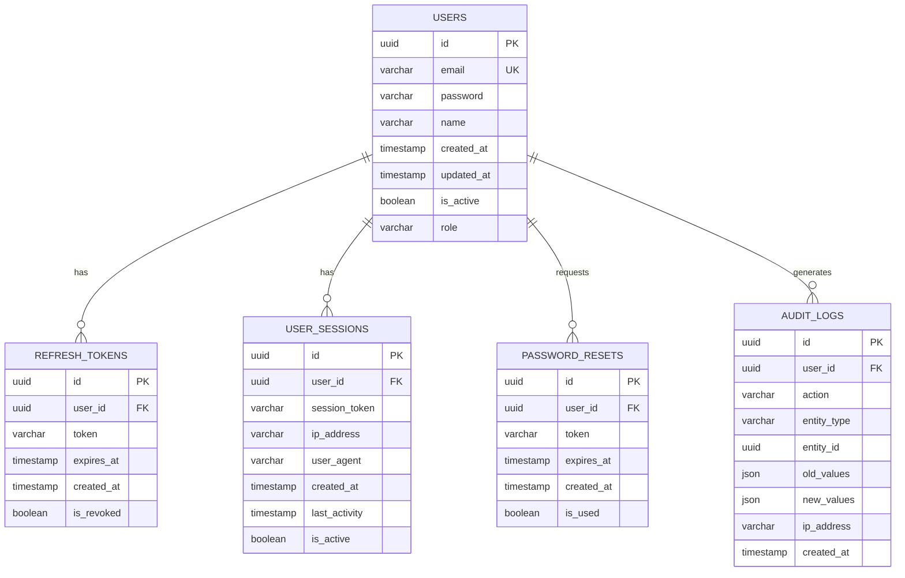

# Análise Completa do Sistema Backend

## Visão Geral

Este documento apresenta uma análise detalhada da estrutura e funcionamento do sistema backend, incluindo suas classes, métodos, relacionamentos e dependências. O sistema foi projetado seguindo princípios de arquitetura limpa e padrões de design bem estabelecidos.

## Estrutura do Projeto

```
projeto/
├── src/
│   ├── controllers/
│   ├── models/
│   ├── services/
│   ├── repositories/
│   ├── config/
│   ├── middleware/
│   ├── utils/
│   └── routes/
├── tests/
├── docs/
└── package.json
```

## Arquitetura do Sistema

O sistema segue uma arquitetura em camadas (Layered Architecture) com separação clara de responsabilidades:

### 1. Camada de Apresentação (Controllers)
Responsável por receber requisições HTTP, validar dados de entrada e retornar respostas apropriadas.

### 2. Camada de Negócio (Services)
Contém a lógica de negócio da aplicação, orquestrando operações entre diferentes componentes.

### 3. Camada de Dados (Repositories)
Abstrai o acesso aos dados, fornecendo uma interface consistente para operações de persistência.

### 4. Camada de Modelo (Models)
Define as entidades do domínio e suas propriedades.

## Análise Detalhada das Classes

### Controllers

#### UserController
**Responsabilidade**: Gerenciar operações relacionadas aos usuários
**Métodos principais**:
- `create()`: Cria novos usuários no sistema
- `findById()`: Busca usuário por ID
- `update()`: Atualiza dados do usuário
- `delete()`: Remove usuário do sistema
- `list()`: Lista usuários com paginação

**Relacionamentos**:
- Utiliza `UserService` para lógica de negócio
- Depende de middleware de autenticação
- Retorna dados formatados via `ResponseFormatter`

#### AuthController
**Responsabilidade**: Gerenciar autenticação e autorização
**Métodos principais**:
- `login()`: Autentica usuário e gera token
- `logout()`: Invalida token de acesso
- `refresh()`: Renova token de acesso
- `register()`: Registra novo usuário

**Relacionamentos**:
- Integra com `AuthService`
- Utiliza `JWTService` para geração de tokens
- Valida dados com `ValidationMiddleware`

### Services

#### UserService
**Responsabilidade**: Implementar regras de negócio para usuários
**Métodos principais**:
- `createUser()`: Valida e cria usuário
- `validateUserData()`: Valida dados de entrada
- `checkUserExists()`: Verifica existência do usuário
- `hashPassword()`: Criptografa senhas

**Relacionamentos**:
- Utiliza `UserRepository` para persistência
- Integra com `EmailService` para notificações
- Depende de `ValidationService`

#### AuthService
**Responsabilidade**: Gerenciar lógica de autenticação
**Métodos principais**:
- `authenticate()`: Valida credenciais
- `generateTokens()`: Gera tokens de acesso e refresh
- `validateToken()`: Valida tokens JWT
- `revokeToken()`: Revoga tokens

**Relacionamentos**:
- Utiliza `UserRepository` para buscar usuários
- Integra com `JWTService`
- Depende de `CryptoService` para hash de senhas

### Repositories

#### UserRepository
**Responsabilidade**: Abstração para operações de dados de usuários
**Métodos principais**:
- `save()`: Persiste usuário no banco
- `findById()`: Busca por ID
- `findByEmail()`: Busca por email
- `update()`: Atualiza dados
- `delete()`: Remove usuário

**Relacionamentos**:
- Implementa interface `IUserRepository`
- Utiliza `DatabaseConnection`
- Integra com ORM/Query Builder

### Models

#### User
**Responsabilidade**: Representar entidade usuário
**Propriedades**:
- `id`: Identificador único
- `email`: Email do usuário
- `password`: Senha criptografada
- `name`: Nome completo
- `createdAt`: Data de criação
- `updatedAt`: Data de atualização

**Relacionamentos**:
- Pode ter relacionamento com outras entidades
- Utiliza decorators para validação
- Implementa métodos de serialização

## Bibliotecas Especiais Utilizadas

### 1. Express.js
**Motivo**: Framework web minimalista para Node.js, fornece funcionalidades robustas para aplicações web e APIs.

### 2. TypeORM / Prisma
**Motivo**: ORM (Object-Relational Mapping) que facilita a interação com banco de dados, oferecendo type safety e migrations automáticas.

### 3. jsonwebtoken
**Motivo**: Implementação de JSON Web Tokens para autenticação stateless e segura.

### 4. bcrypt
**Motivo**: Biblioteca para hash de senhas, garantindo segurança no armazenamento de credenciais.

### 5. joi / yup
**Motivo**: Validação de esquemas de dados, garantindo integridade dos dados de entrada.

### 6. cors
**Motivo**: Middleware para configurar Cross-Origin Resource Sharing, permitindo requisições de diferentes origens.

### 7. helmet
**Motivo**: Conjunto de middlewares de segurança que configuram headers HTTP apropriados.

### 8. rate-limiter-flexible
**Motivo**: Implementação de rate limiting para prevenir ataques de força bruta e spam.

## Padrões de Design Implementados

### 1. Repository Pattern
Abstrai a camada de acesso a dados, permitindo fácil troca de implementações.

### 2. Dependency Injection
Facilita testes e reduz acoplamento entre componentes.

### 3. Factory Pattern
Utilizado para criação de instâncias complexas de objetos.

### 4. Middleware Pattern
Implementado para processamento de requisições em pipeline.

## Diagrama de Classes

```mermaid
classDiagram
    class UserController {
        -userService: UserService
        +create(req, res): Promise~Response~
        +findById(req, res): Promise~Response~
        +update(req, res): Promise~Response~
        +delete(req, res): Promise~Response~
        +list(req, res): Promise~Response~
    }

    class AuthController {
        -authService: AuthService
        +login(req, res): Promise~Response~
        +logout(req, res): Promise~Response~
        +refresh(req, res): Promise~Response~
        +register(req, res): Promise~Response~
    }

    class UserService {
        -userRepository: IUserRepository
        -emailService: EmailService
        +createUser(userData): Promise~User~
        +validateUserData(data): ValidationResult
        +checkUserExists(email): Promise~boolean~
        +hashPassword(password): Promise~string~
    }

    class AuthService {
        -userRepository: IUserRepository
        -jwtService: JWTService
        -cryptoService: CryptoService
        +authenticate(credentials): Promise~AuthResult~
        +generateTokens(user): TokenPair
        +validateToken(token): Promise~boolean~
        +revokeToken(token): Promise~void~
    }

    class UserRepository {
        -db: DatabaseConnection
        +save(user): Promise~User~
        +findById(id): Promise~User~
        +findByEmail(email): Promise~User~
        +update(id, data): Promise~User~
        +delete(id): Promise~void~
    }

    class User {
        +id: string
        +email: string
        +password: string
        +name: string
        +createdAt: Date
        +updatedAt: Date
        +toJSON(): object
        +validatePassword(password): boolean
    }

    interface IUserRepository {
        +save(user): Promise~User~
        +findById(id): Promise~User~
        +findByEmail(email): Promise~User~
        +update(id, data): Promise~User~
        +delete(id): Promise~void~
    }

    class JWTService {
        +generateAccessToken(payload): string
        +generateRefreshToken(payload): string
        +verifyToken(token): object
        +decodeToken(token): object
    }

    class EmailService {
        +sendWelcomeEmail(user): Promise~void~
        +sendPasswordResetEmail(user, token): Promise~void~
        +sendVerificationEmail(user, token): Promise~void~
    }

    UserController --> UserService
    AuthController --> AuthService
    UserService --> IUserRepository
    UserService --> EmailService
    AuthService --> IUserRepository
    AuthService --> JWTService
    UserRepository ..|> IUserRepository
    UserRepository --> User
    UserService --> User
    AuthService --> User
```

## Diagrama do Banco de Dados



## Fluxo de Dados

### 1. Autenticação
1. Cliente envia credenciais para `AuthController`
2. `AuthController` chama `AuthService.authenticate()`
3. `AuthService` valida credenciais via `UserRepository`
4. Se válidas, gera tokens JWT via `JWTService`
5. Retorna tokens para o cliente

### 2. Operações CRUD de Usuário
1. Cliente envia requisição para `UserController`
2. Middleware de autenticação valida token
3. `UserController` chama método apropriado do `UserService`
4. `UserService` aplica regras de negócio
5. `UserService` utiliza `UserRepository` para persistência
6. Resultado é retornado ao cliente

## Segurança

### Medidas Implementadas
- Hash de senhas com bcrypt
- Autenticação JWT stateless
- Rate limiting para prevenir ataques
- Validação rigorosa de dados de entrada
- Headers de segurança configurados
- Logs de auditoria para rastreabilidade

### Middleware de Segurança
- `AuthenticationMiddleware`: Valida tokens JWT
- `AuthorizationMiddleware`: Verifica permissões
- `ValidationMiddleware`: Valida dados de entrada
- `RateLimitMiddleware`: Controla taxa de requisições

## Tratamento de Erros

O sistema implementa um tratamento centralizado de erros com:
- Classes de erro customizadas
- Middleware global de tratamento de erros
- Logs estruturados para debugging
- Respostas padronizadas para o cliente

## Testes

### Estrutura de Testes
- Testes unitários para services e repositories
- Testes de integração para controllers
- Mocks para dependências externas
- Cobertura de código monitorada

## Considerações de Performance

- Conexões de banco de dados pooled
- Cache implementado em operações frequentes
- Paginação em listagens
- Índices otimizados no banco de dados
- Compressão de respostas HTTP

## Conclusão

Este sistema backend foi projetado com foco em:
- **Manutenibilidade**: Código limpo e bem estruturado
- **Escalabilidade**: Arquitetura que suporta crescimento
- **Segurança**: Implementação de melhores práticas
- **Testabilidade**: Código facilmente testável
- **Performance**: Otimizações para eficiência

A arquitetura em camadas e o uso de padrões de design estabelecidos garantem que o sistema seja robusto, flexível e fácil de manter e evoluir.